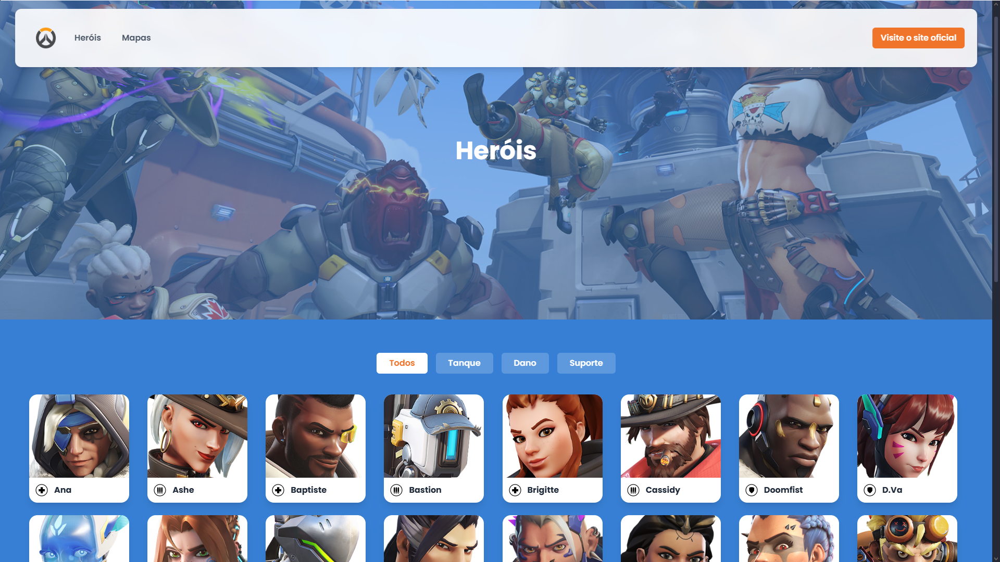
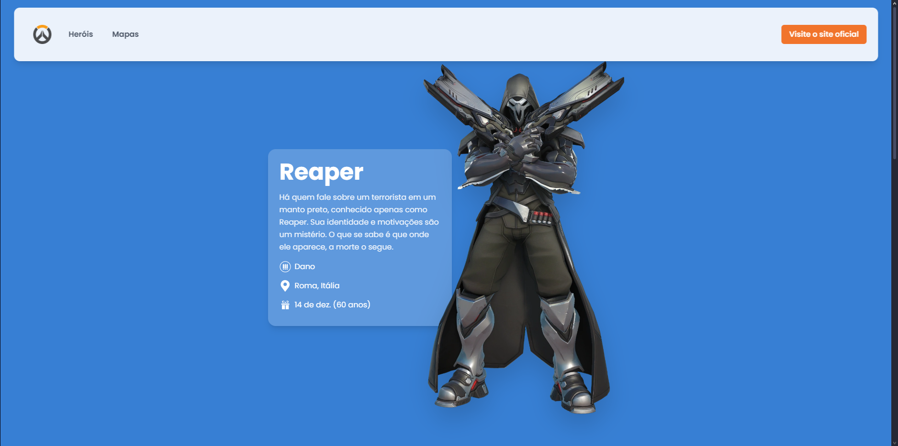
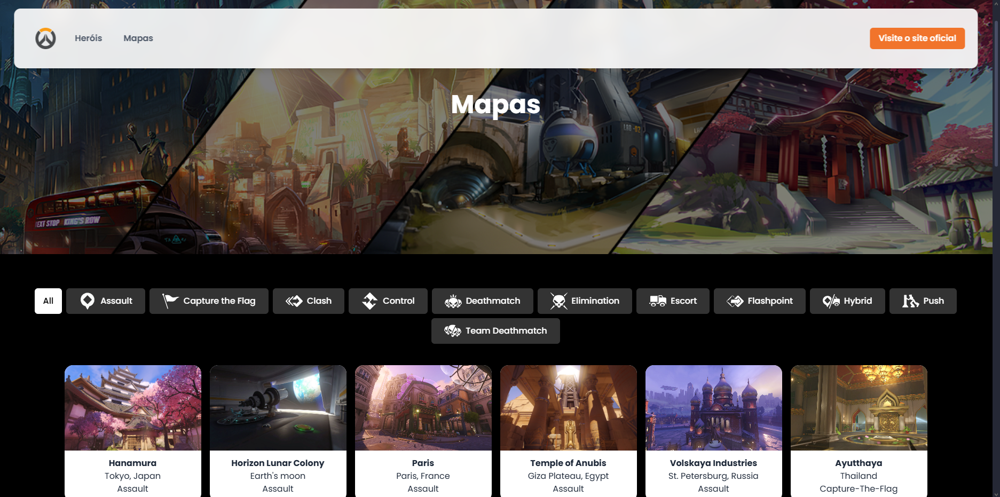

# DashOW

**DashOW** é uma aplicação web que consome a API do jogo Overwatch para exibir informações detalhadas sobre os heróis e mapas do jogo. Desenvolvido com **React.js**, **Tailwind CSS** e **Radix UI**, o projeto tem como foco a performance, responsividade e uma experiência visual moderna.

## 🚀 Tecnologias

- React.js
- Tailwind CSS
- Radix UI
- Fetch API
- Vite

## 📸 Preview

> 
> 
> 

## 📦 Funcionalidades

- ✅ Listagem dos heróis do Overwatch
- ✅ Listagem dos mapas do jogo
- 🔍 Visual moderno com estilo flutuante para o menu em telas grandes
- 📱 Layout responsivo adaptado para mobile com menu hambúrguer

## Instalação e uso
```
git clone https://github.com/Bruna-caraca/OverFast-api.git
```

#### Acesse a pasta do projeto
```
cd OverFast-api
```
#### Instale as dependências
```
npm install
```

#### Inicie o servidor de desenvolvimento
```
npm run dev
```
## 🧠 Inspiração
Este projeto foi criado com o intuito de explorar a API do Overwatch e praticar tecnologias modernas de frontend

